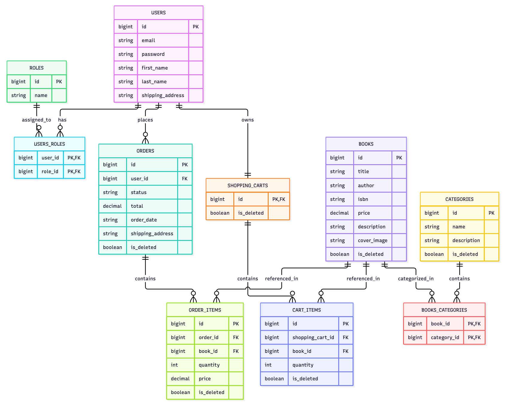

# Book Store REST API

[](https://github.com/ReduxR/book-store/actions)


## Overview

Book Store API is a RESTful backend service providing core e-commerce capabilities for an online
bookstore — catalog administration, dynamic multi-field book search, customer shopping carts, and
order processing, replacing what would otherwise be manual, in-person-only workflows.

The project implements production-grade backend patterns: stateless JWT authentication with
role-based access control (RBAC), automated Liquibase database migrations, automated
testing with Testcontainers, and containerized deployment on AWS infrastructure.

Most pull requests went through mandatory mentor review before merging. Rather than receiving
ready-made fixes, I got feedback pointing to the problem — I was responsible for figuring out and
implementing the actual correction myself.

## Technologies & Tools

| Area                | Technologies                                            | What it is used for                                                                   |
|:--------------------|:--------------------------------------------------------|:--------------------------------------------------------------------------------------|
| **Core**            | Java 17, Spring Boot 4.x, Spring Web                    | Application setup, dependency injection, and REST controllers.                        |
| **Security**        | Spring Security, JWT (`jjwt`), BCrypt                   | Stateless authentication, password hashing, and role checks (`@PreAuthorize`).        |
| **Database**        | Spring Data JPA, Hibernate, Liquibase, MySQL            | Database queries, soft deletes (`@SQLDelete`), dynamic search, and schema migrations. |
| **Tools & Helpers** | Lombok, MapStruct, Jakarta Bean Validation              | Boilerplate reduction, compile-time DTO mapping, and declarative request validation.  |
| **Testing**         | JUnit 5, Mockito, Spring `@DataJpaTest`, Testcontainers | Unit tests, repository slice tests, and controller integration tests.                 |
| **DevOps & Cloud**  | Docker, AWS (EC2, ECR, RDS), GitHub Actions             | Containerized builds, cloud deployment, and automated CI.                             |

## Database Architecture (ER Diagram)

The relational schema represents the core entity relationships supporting catalog management,
shopping cart operations, and orders:

<p align="center">
  
</p>

## Testing Strategy

The test suite covers three levels:

* **Unit tests** (`*ServiceTest`) — service layer logic tested in isolation with Mockito, no Spring
  context involved.
* **Slice tests** (`BookRepositoryTest`) — `@DataJpaTest` boots only the JPA layer against a real
  MySQL instance (via Testcontainers), verifying custom queries and entity mappings.
* **Integration tests** (`*ControllerTest`) — `@SpringBootTest` boots the full application context
  (security, controllers, services, database) and exercises it through `MockMvc`.

## Cloud Deployment Architecture (AWS)

* **Amazon ECR** — stores the versioned Docker image built from this repository.
* **Amazon EC2** — pulls the image from ECR and runs the container, exposing it on port 80.
* **Amazon RDS (MySQL)** — managed database instance, running separately from the EC2 instance.
* **AWS Security Groups** — protects port 3306 on RDS, allowing incoming connections only from the
  EC2 instance's security group.

Production configuration (datasource URL, credentials, JWT secret) is passed directly as
container runtime arguments on EC2, as opposed to the `.env` file used for the local Docker
Compose setup.

## User Roles & Authentication

The API enforces strict Role-Based Access Control (RBAC) across both cloud and local environments.

### 1. Administrator (`ADMIN`)

Manages the store catalog and order delivery status. Public registration of admin accounts is
disabled. A default account is seeded automatically by Liquibase on startup:

* **Email:** `admin@admin.com`
* **Password:** `123456`

> **Note on domain boundaries:** administrators manage inventory and do not have shopping carts —
> calling customer endpoints (`/cart`) with an admin token is intentionally unsupported.

### 2. Customer (`USER`)

Browses books, manages personal cart items, and places orders:

1. Register a new account via `POST /auth/registration` (a shopping cart is automatically created
   for
   the user).
2. Authenticate via `POST /auth/login` to obtain an access token.
3. Pass the token in the `Authorization: Bearer <token>` header for customer routes.

## API Exploration & Setup Guide

Choose how you want to interact with the API:

### Option 1 — Live Cloud Environment (Zero Setup)

The application is deployed on AWS and fully operational.

* **Swagger UI:** http://ec2-51-20-248-111.eu-north-1.compute.amazonaws.com/swagger-ui/index.html
* **OpenAPI spec:** http://ec2-51-20-248-111.eu-north-1.compute.amazonaws.com/v3/api-docs

#### Testing in Swagger UI

1. Run `POST /auth/login` using the admin credentials above or your own registered credentials.
2. Copy the `token` string from the JSON response.
3. Click the green **Authorize** button (top right of the page), paste the token, and click
   **Authorize**.

#### Testing in Postman

1. In Postman, click **Import** (top left).
2. Paste the specification URL:
   `http://ec2-51-20-248-111.eu-north-1.compute.amazonaws.com/v3/api-docs`.
3. Postman generates a complete collection organized by controller, with pre-configured schemas.
4. Run `POST /auth/login`, copy the returned token, then set the collection's **Authorization**
   type to **Bearer Token**.

### Option 2 — Local Development Setup (Docker Compose)

**Prerequisites:** Docker and Docker Compose installed.

1. **Clone the repository:**
   ```bash
   git clone https://github.com/ReduxR/book-store.git
   cd book-store
   ```

2. **Configure environment variables:**
   ```bash
   cp .env.template .env
   ```
   Open `.env` and set your local port mappings, database credentials, and `JWT_SECRET_KEY`.


3. **Start services:**
   ```bash
   docker-compose up --build -d
   ```
   Liquibase applies database migrations and seeds the default admin account automatically.


4. **Verify the running instance:**
    * Local Swagger UI: `http://localhost:<SPRING_LOCAL_PORT>/swagger-ui/index.html`
    * Local OpenAPI spec: `http://localhost:<SPRING_LOCAL_PORT>/v3/api-docs`

## API Reference

<details>
<summary><b>Click to expand endpoint & role matrix</b></summary>

### Authentication (`/auth`)

| Method | Endpoint             | Description         | Access |
|:-------|:---------------------|:--------------------|:-------|
| POST   | `/auth/registration` | Register a new user | Public |
| POST   | `/auth/login`        | Login and get a JWT | Public |

### Books (`/books`)

| Method | Endpoint        | Description                       | Access      |
|:-------|:----------------|:----------------------------------|:------------|
| GET    | `/books`        | Get paginated list of books       | USER, ADMIN |
| GET    | `/books/{id}`   | Get book by id                    | USER, ADMIN |
| GET    | `/books/search` | Search books by parameters        | USER, ADMIN |
| POST   | `/books`        | Add a new book                    | ADMIN       |
| PUT    | `/books/{id}`   | Update book details (except ISBN) | ADMIN       |
| DELETE | `/books/{id}`   | Soft delete a book                | ADMIN       |

### Categories (`/categories`)

| Method | Endpoint                 | Description            | Access      |
|:-------|:-------------------------|:-----------------------|:------------|
| GET    | `/categories`            | Get all categories     | USER, ADMIN |
| GET    | `/categories/{id}`       | Get category by id     | USER, ADMIN |
| GET    | `/categories/{id}/books` | Get books by category  | USER, ADMIN |
| POST   | `/categories`            | Add a new category     | ADMIN       |
| PUT    | `/categories/{id}`       | Update a category      | ADMIN       |
| DELETE | `/categories/{id}`       | Soft delete a category | ADMIN       |

### Shopping Cart (`/cart`)

| Method | Endpoint                   | Description                  | Access |
|:-------|:---------------------------|:-----------------------------|:-------|
| GET    | `/cart`                    | Get current user's cart      | USER   |
| POST   | `/cart`                    | Add a book to the cart       | USER   |
| PUT    | `/cart/items/{cartItemId}` | Update item quantity         | USER   |
| DELETE | `/cart/items/{cartItemId}` | Remove an item from the cart | USER   |

### Orders (`/orders`)

| Method | Endpoint                       | Description                       | Access |
|:-------|:-------------------------------|:----------------------------------|:-------|
| GET    | `/orders`                      | View current user's order history | USER   |
| POST   | `/orders`                      | Place an order from cart items    | USER   |
| GET    | `/orders/{orderId}/items`      | View items in an order            | USER   |
| GET    | `/orders/{orderId}/items/{id}` | View a single item in an order    | USER   |
| PATCH  | `/orders/{id}`                 | Update order status               | ADMIN  |

</details>

## Engineering Challenges

### 1. `LazyInitializationException` on Book Categories

* **Challenge:**  
  After introducing category support, reading `book.getCategories()` in the mapper started
  throwing `LazyInitializationException`. Since `spring.jpa.open-in-view` is disabled, the
  Hibernate session closes right after the service/transaction boundary — so any lazy-loaded
  association accessed later (e.g. during DTO mapping) fails, rather than silently triggering an
  extra query as it would with the default `open-in-view=true`.


* **Solution:**  
  Ensured the needed associations are fetched eagerly *within* the transaction itself:
  `@EntityGraph`
  for endpoints that simply need the relation loaded (`findById`, the specification-based
  `findAll`), and a `@Query` with `JOIN FETCH` where the association also had to participate in
  the filtering condition (`findAllByCategoryId`, filtering books by `category.id`). Keeping
  `open-in-view=false` was a deliberate choice — it surfaces missing fetch strategies immediately
  during development instead of letting them degrade performance silently in production.

### 2. Inverted Token Expiration Check

* **Challenge:**  
  The initial implementation of `JwtUtil.isValidToken()` had an inverted boolean condition —
  `claimsJws.getPayload().getExpiration().before(new Date())` was returned directly, without
  negation. Since `.before(now)` is `true` only for an *already expired* token, the logic was
  exactly backwards: a freshly issued token was treated as invalid immediately after login, while
  an expired token would have been accepted as valid.


* **Solution:**  
  Negated the condition (`!claimsJws.getPayload().getExpiration().before(new Date())`), so the
  method correctly returns `true` only while the token's expiration is still in the future. The
  bug was a reminder to read boolean expressions involving `.before()`/`.after()` literally,
  word by word, rather than assuming the intended meaning — a single missing `!` here would have
  either locked out every user or silently accepted expired tokens.